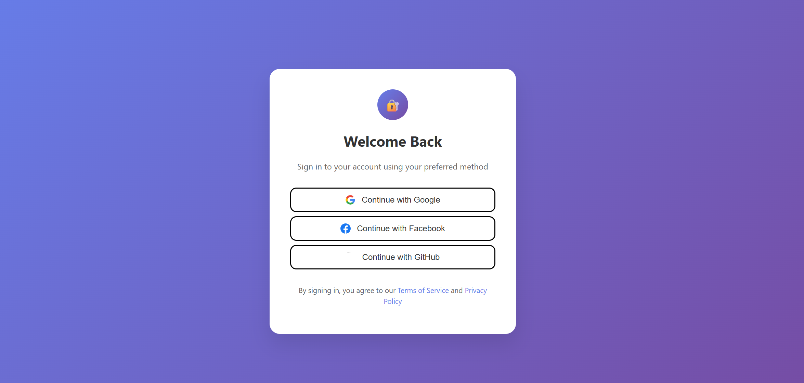

# 🔐 Multiple Platform Authentication App

A modern, full-stack authentication application that supports multiple OAuth providers (Google, Facebook, GitHub) with account linking capabilities. Built with React, TypeScript, Node.js, and Firebase.



## ✨ Features

- **Multiple OAuth Providers**: Support for Google, Facebook, and GitHub authentication
- **Account Linking**: Automatically link accounts with the same email across different providers
- **Modern UI**: Beautiful, responsive design with smooth animations
- **TypeScript**: Full type safety across frontend and backend
- **Firebase Integration**: Secure authentication with Firebase Auth
- **JWT Tokens**: Backend verification using Firebase ID tokens
- **Error Handling**: Comprehensive error handling for authentication flows

## 🛠️ Tech Stack

### Frontend
- **React 19** with TypeScript
- **Vite** for fast development and building
- **Firebase Auth** for authentication
- **Axios** for HTTP requests
- **Modern CSS** with inline styles for beautiful UI

### Backend
- **Node.js** with Express
- **Firebase Admin SDK** for token verification
- **CORS** enabled for cross-origin requests

## 📋 Prerequisites

Before you begin, ensure you have the following installed:
- **Node.js** (v16 or higher)
- **npm** or **yarn**
- **Firebase account** and project setup

## 🚀 Quick Start

### 1. Clone the Repository

```bash
git clone <repository-url>
cd Multiple_platform_auth
```

### 2. Firebase Setup

1. Go to [Firebase Console](https://console.firebase.google.com/)
2. Create a new project or use an existing one
3. Enable Authentication and configure OAuth providers:
   - **Google**: Enable Google provider
   - **Facebook**: Enable Facebook provider with App ID and App Secret
   - **GitHub**: Enable GitHub provider with Client ID and Client Secret
4. Get your Firebase config object from Project Settings > General > Your apps

### 3. Environment Configuration

#### Frontend Configuration
Create `frontend/src/firebaseConfig.ts`:

```typescript
import { initializeApp } from "firebase/app";
import { getAuth, GoogleAuthProvider, FacebookAuthProvider, GithubAuthProvider } from "firebase/auth";

const firebaseConfig = {
  apiKey: "your-api-key",
  authDomain: "your-project.firebaseapp.com",
  projectId: "your-project-id",
  storageBucket: "your-project.appspot.com",
  messagingSenderId: "123456789",
  appId: "your-app-id"
};

const app = initializeApp(firebaseConfig);
export const auth = getAuth(app);

export const providers = {
  google: new GoogleAuthProvider(),
  facebook: new FacebookAuthProvider(),
  github: new GithubAuthProvider(),
};
```

#### Backend Configuration
1. Download your Firebase service account key from Firebase Console > Project Settings > Service Accounts
2. Place the JSON file in `backend/` directory
3. Update the path in `backend/index.js` if needed

### 4. Install Dependencies

#### Frontend
```bash
cd frontend
npm install
```

#### Backend
```bash
cd backend
npm install
```

### 5. Run the Application

#### Start Backend Server
```bash
cd backend
npm start
# Server runs on http://localhost:4000
```

#### Start Frontend Development Server
```bash
cd frontend
npm run dev
# App runs on http://localhost:5173
```

## 📱 Usage

1. **Open the application** in your browser at `http://localhost:5173`
2. **Choose a provider** to sign in (Google, Facebook, or GitHub)
3. **Complete OAuth flow** in the popup window
4. **Account linking**: If you try to sign in with a different provider using the same email, the app will automatically link the accounts

## 🔧 API Endpoints

### Backend Routes

- `GET /profile` - Get user profile information
  - **Headers**: `Authorization: Bearer <firebase-id-token>`
  - **Response**: User profile data

## 🎨 UI Features

- **Gradient Background**: Beautiful purple gradient background
- **Card Design**: Clean white card with rounded corners and shadow
- **Interactive Buttons**: Hover effects and loading states
- **Provider Icons**: Official brand icons for each OAuth provider
- **Responsive Design**: Works on desktop and mobile devices
- **Loading States**: Visual feedback during authentication process

## 🔒 Security Features

- **Firebase ID Token Verification**: Backend verifies tokens with Firebase Admin SDK
- **CORS Protection**: Configured CORS for secure cross-origin requests
- **Error Handling**: Comprehensive error handling for authentication failures
- **Account Linking**: Secure linking of multiple OAuth accounts

## 📁 Project Structure

```
Multiple_platform_auth/
├── frontend/
│   ├── src/
│   │   ├── components/
│   │   │   └── Login.tsx
│   │   ├── firebaseConfig.ts
│   │   └── main.tsx
│   ├── public/
│   ├── package.json
│   └── vite.config.ts
├── backend/
│   ├── index.js
│   ├── package.json
│   └── firebase-service-account.json
├── screenshots/
└── README.md
```

## 🐛 Troubleshooting

### Common Issues

1. **Firebase Configuration Error**
   - Ensure all Firebase config values are correct
   - Check that OAuth providers are enabled in Firebase Console

2. **CORS Issues**
   - Verify backend CORS configuration
   - Check that frontend is making requests to correct backend URL

3. **Authentication Popup Blocked**
   - Ensure popups are allowed in browser settings
   - Try using a different browser

4. **Account Linking Issues**
   - Verify that email addresses match across providers
   - Check Firebase console for authentication logs

## 📸 Screenshots

### Login Screen


### Authentication Flow


### Account Linking


## 🤝 Contributing

1. Fork the repository
2. Create a feature branch (`git checkout -b feature/amazing-feature`)
3. Commit your changes (`git commit -m 'Add some amazing feature'`)
4. Push to the branch (`git push origin feature/amazing-feature`)
5. Open a Pull Request

## 📄 License

This project is licensed under the MIT License - see the [LICENSE](LICENSE) file for details.

## 🙏 Acknowledgments

- **Firebase** for authentication services
- **React** team for the amazing framework
- **Vite** for fast development experience
- **OAuth providers** for authentication services

## 📞 Support

If you have any questions or need help, please:
1. Check the troubleshooting section
2. Open an issue on GitHub
3. Contact the development team

---

**Happy Coding! 🚀**
